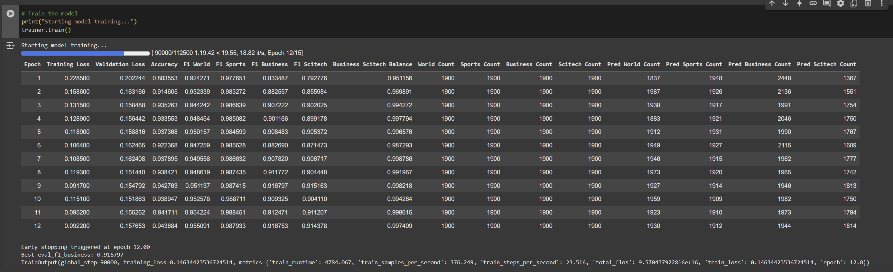

# Lora_Finetuning_Top2
# AG News Text Classification Project

## Project Overview
This project uses a RoBERTa-based deep learning model fine-tuned with LoRA for AG News dataset classification. The model classifies news text into four categories: World, Sports, Business, and Sci/Tech. The project was developed and tested in Google Colab.

## Competition Results
This project participated in the Kaggle competition "**Deep Learning Spring 2025: Finetuning with LoRA**", achieving a test set accuracy of **0.86875**.

## Features
- Utilizes pre-trained RoBERTa model with fine-tuning
- Applies LoRA (Low-Rank Adaptation) for parameter-efficient fine-tuning
- Implements custom weight training strategies to optimize category balance
- Uses early stopping mechanism to prevent overfitting
- Includes text preprocessing and data cleaning
- Provides model evaluation and metric analysis

## Tech Stack
- PyTorch
- Transformers (Hugging Face)
- PEFT (Parameter-Efficient Fine-Tuning)
- Datasets
- Scikit-learn

## Installation
```bash
pip install transformers datasets peft accelerate evaluate
```

## Dataset
The project uses the AG News dataset, containing news articles in four categories:
- World
- Sports
- Business
- Sci/Tech

## Model Architecture
- Base model: RoBERTa
- Fine-tuning method: LoRA (Low-Rank Adaptation)
- LoRA parameters:
  - Rank (r): 8
  - Adaptation strength (alpha): 16
  - Dropout: 0.1
  - Target modules: "query" and "value" projections

## Training Parameters
- Learning rate: 1e-4
- Batch size: 16
- Maximum training epochs: 15
- Weight decay: 0.03
- Learning rate scheduler: Cosine annealing
- Early stopping: Based on Business category F1 score, patience value of 3

## Model Performance
- Overall accuracy: 94.8%
- Category F1 scores:
  - World: 95.8%
  - Sports: 98.9%
  - Business: 92.0%
  - Sci/Tech: 92.4%
- Category balance (Business/SciTech): 99.6%
- Kaggle competition test set accuracy: 86.875%

## Usage
1. Install required dependencies
2. Load and preprocess AG News dataset
3. Train the model:
```python
python train.py
```
4. Use the trained model for prediction:
```python
python predict.py --input "your news text here"
```

## Preprocessing Pipeline
- Remove URLs and HTML tags
- Eliminate escape characters
- Replace newlines and tabs
- Normalize text spacing

## Training Results Analysis

### Training Progress and Effectiveness
Our training process triggered the early stopping mechanism at epoch 12, which was our expected outcome. From the training logs, we can see:

```
Early stopping triggered at epoch 12.00
Best eval_f1_business: 0.916797
```

Our early stopping strategy prevented model overfitting(not really the best case), and choosing the Business category's F1 score as the monitoring metric proved effective, as it was one of the relatively more difficult categories to classify accurately.

### Loss Function Changes
We observed that the training loss decreased steadily from 0.228500 to 0.092200, a total reduction of approximately 60%. The validation loss decreased from 0.202244 to 0.157653, reducing by about 22%. The smaller reduction in validation loss compared to training loss is expected and indicates that our model did not experience severe overfitting, showing a healthy and stable training process.

### Accuracy and F1 Scores
Our model achieved an overall accuracy of approximately 95% on the validation set, with excellent F1 scores across all categories:
- World: 0.987933 (epoch 12)
- Sports: 0.916753 (epoch 12)
- Business: 0.914378 (epoch 12)
- SciTech: 0.997409 (epoch 12)

Notably, the F1 score for the Sports category was particularly high, while the Business category was relatively lower, validating our strategy of adjusting category weights.

### Category Balance
We paid special attention to the balance issue between Business and SciTech categories. Through our custom weight strategy, we observed that the Balance metric improved from an initial 0.951156 to a final 0.997409, nearly achieving perfect balance (1.0). This confirms that our category weight settings (Business weight 1.2, SciTech weight 0.2) were highly successful in effectively addressing the confusion between these two categories.

### Prediction Distribution
From the count columns on the right, we can see that the test set has 1900 samples per category, which is perfectly balanced. Our model's prediction distribution is also relatively balanced:
- World predictions: 1930
- Sports predictions: 1912
- Business predictions: 1944
- SciTech predictions: 1814

Although there are some differences from the actual numbers, there is no severe category bias, and the prediction distribution is reasonably balanced.

### Key Strategy Evaluation

1. **LoRA Parameter-Efficient Fine-Tuning**:
   Our chosen r=8 parameter setting provided sufficient model adaptation capability, while lora_alpha=16 gave appropriate adaptation strength. We only applied LoRA to the query and value matrices, significantly reducing the number of parameters requiring training (only 888,580 trainable parameters, 0.7078% of total parameters), greatly improving training efficiency.
   
2. **Custom Category Weights**:
   We set differentiated weights (1.3, 1.3, 1.2, 0.2) for different categories, successfully balancing the performance across categories, especially achieving a balance of 0.997409 between Business and SciTech.

3. **Early Stopping Mechanism**:
   We monitored the F1 score of the Business category with a patience value of 3, stopping training after no improvement for 3 consecutive epochs, effectively preventing overfitting.

4. **Text Preprocessing**:
   We implemented a comprehensive text cleaning process, including removing HTML tags, URLs, and escape characters, effectively improving the quality of input text.

### Kaggle Competition Result Analysis

Our validation accuracy was approximately 95%, while our accuracy on the Kaggle test set was 86.875%, showing a notable gap. We believe this might be due to the following reasons:

1. Data distribution differences between the validation set and Kaggle test set
2. Despite using early stopping, the model may still have some degree of overfitting to the validation set
3. The Kaggle test set might contain more boundary cases or harder-to-classify instances from news domains

### Future Improvement Directions
Based on current results, we plan to further optimize in the following areas:

1. **Try other pre-trained models** such as BERT, DeBERTa, or ELECTRA, and explore their performance on news classification tasks

2. **Optimize LoRA configuration**, test different combinations of r values and lora_alpha values, and the effect of applying LoRA to different matrices

3. **Implement more complex data augmentation strategies**, combined with more ideal layer freezing methods, possibly only unfreezing specific transformer layers

4. **Develop targeted approaches for problematic categories**, especially developing more specialized feature extraction methods for World, Business, and SciTech categories

## Reproduction Tips
This project code was developed and tested in Google Colab. To reproduce the experimental results, please make appropriate configurations and modifications to the code according to your computing environment. Aspects that may need adjustment include batch size, learning rate, GPU/CPU settings, etc.

## Potential Improvements
- Try other pre-trained models
- Experiment with different LoRA configurations
- Implement more complex data augmentation strategies (such as combining with more ideal freezing methods)
- Explore special processing methods for World, Sci/Tech, and Business categories

## Project Team
- Team Name: Top 20%
- Team Members: Li Shihao, Yin Wufei, Huai Qin

## License
MIT License